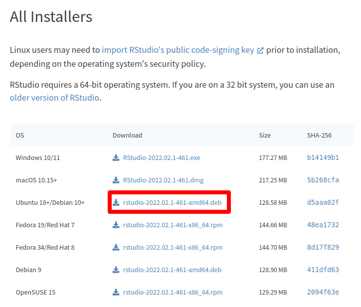

# Linux {#linux}

```{r, out.width="15%"}
knitr::include_graphics("images/os/tux-flat.png")
```

## Instalación de R

En este apartado se describen las instrucciones para instalar R en Ubuntu. Para otras distribuciones de Linux consulta [este link](https://cloud.r-project.org/bin/linux/){target="_blank"}.


```{r, out.width="15%"}
knitr::include_graphics("images/os/ubuntu.png")
```

Para instalar R en Ubuntu necesitamos instalar los paquetes `r-base`  y  `r-base-dev`. Siguiendo los siguientes pasos obtendrás las versiones más recientes y recibirás las últimas actualizaciones. 

**PASO 1: ** Actualizar los índices: 
```{bash, eval=FALSE, echo=TRUE}
sudo apt update 
```

**PASO 2: ** Instalar un par de paquetes auxiliares: 
```{bash, eval=FALSE, echo=TRUE}
sudo apt install --no-install-recommends software-properties-common dirmngr 
```

**PASO 3: ** Añadir la clave para el repositorio que añadiremos en el siguiente paso (por Michael Rutter):
```{bash, eval=FALSE, echo=TRUE}
wget -qO- https://cloud.r-project.org/bin/linux/ubuntu/marutter_pubkey.asc | sudo tee -a /etc/apt/trusted.gpg.d/cran_ubuntu_key.asc
```

**PASO 4: ** Añadir repositorio (de [CRAN](https://cran.r-project.org/){target="_blank"}):
```{bash, eval=FALSE, echo=TRUE}
sudo add-apt-repository "deb https://cloud.r-project.org/bin/linux/ubuntu $(lsb_release -cs)-cran40/"
```

**PASO 5: ** Volver a actualizar los índices: 
```{bash, eval=FALSE, echo=TRUE}
sudo apt update 
```

**PASO 6: ** Instalar `r-base` y `r-base-dev`: 
```{bash, eval=FALSE, echo=TRUE}
sudo apt install --no-install-recommends r-base r-base-dev 
```

<!-- También puedes hacer la instalación desde **Ubuntu Software**. -->

 

## Instalación de RStudio
Una vez instalado R, sigue los siguientes pasos para instalar RStudio.

**PASO 1: **
Accede a la página de descargas de RStudio pinchando [aquí](https://rstudio.com/products/rstudio/download/#download){target="_blank"}.  

En el apartado **All Installers** descarga el instalador más reciente para tu versión (para Ubuntu 20, descarga Ubuntu 18/Debian 10, ver imagen debajo).

```{r, out.width="90%", out.extra={if(knitr::is_html_output()){'style="border:1px solid gray;"'}}, fig.cap="Página de descargas de RStudio"}

```

**PASO 2: ** 
Cuando se complete la descarga del paso anterior, haz doble click en el archivo `.deb` descargado. Se abrirá con el gestor de software de Ubuntu. Presiona el botón 'Instalar' para terminar.

