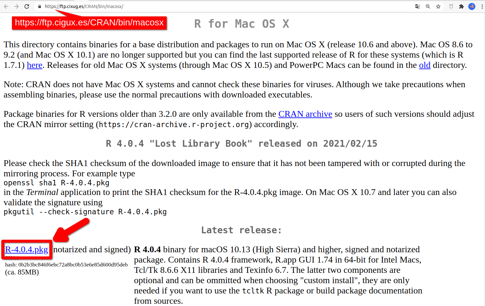
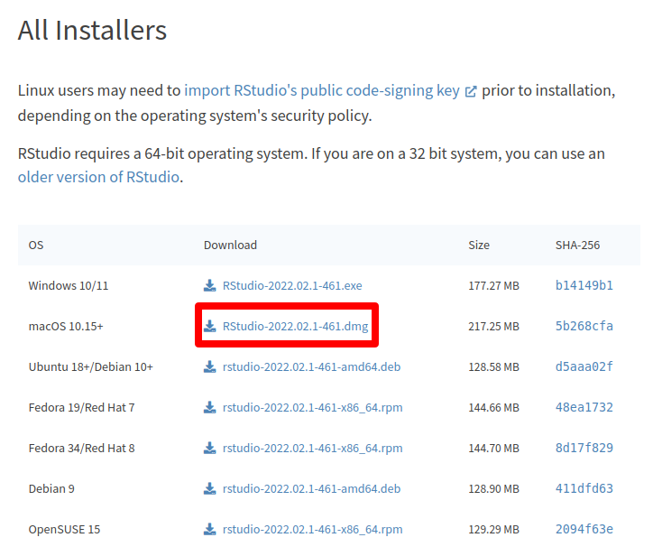

# Mac OS X {#mac}

```{r, out.width="15%"}
knitr::include_graphics("images/os/apple.jpg")
```

## Instalación de R
Accede a la página de descargas de \textsf{R} para Mac OS X pinchando [aquí](https://cloud.r-project.org/bin/macosx/){target="_blank"}  y descarga el instalador correspondiente a la versión de tu equipo (ver imagen).

```{r, out.width="100%", out.extra={if(knitr::is_html_output()){'style="border:1px solid gray;"'}}, fig.cap="Página de descargas de R para Mac"}

```


Solo tienes que ejecutar el archivo `pgk` que se descargará para instalar R en tu equipo. Puedes conservar todas las opciones  de instalación por defecto. 

## Instalación de RStudio
Accede a la página de descargas de RStudio pinchando [aquí](https://rstudio.com/products/rstudio/download/#download){target="_blank"},  y, en la tabla del apartado **All Installers**,  haz click en el link de descarga correspondiente a macOS 10.15+ (ver imagen debajo).

```{r, out.width="90%", out.extra={if(knitr::is_html_output()){'style="border:1px solid gray;"'}}, fig.cap="Página de descargas de RStudio"}

```

Se descargará un archivo `dmg`. Para completar la instalación de RStudio en tu equipo solo tienes que arrastar el icono de la aplicación a tu carpeta Aplicaciones. 

