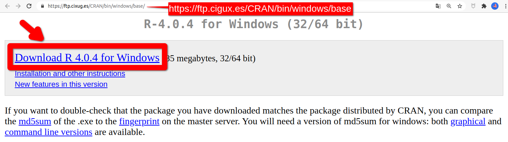
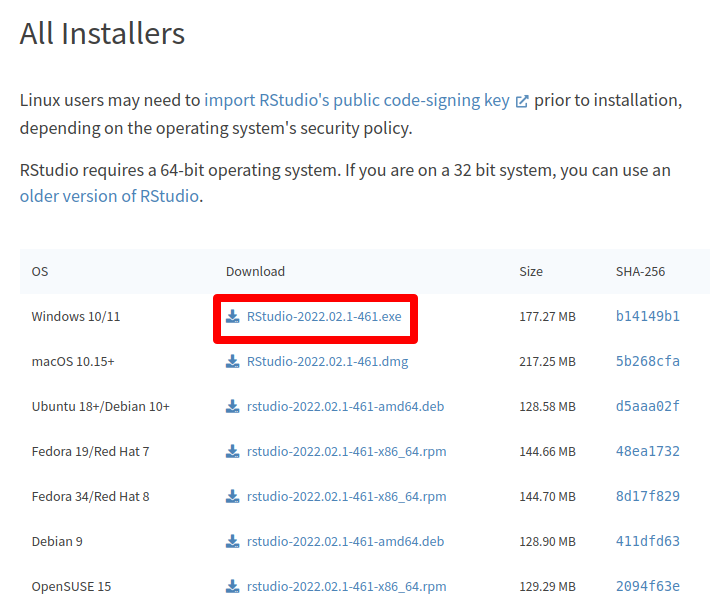

# Windows {#windows}

```{r, out.width="15%"}
knitr::include_graphics("images/os/windows.png")
```

A continuación se proporcionan los links para la descarga de los instaladores de R y RStudio en Windows. En ambos casos, se descargará un archivo ejecutable que gestionará la instalación de R / RStudio en tu equipo. 

Puedes conservar todas las opciones de instalación que aparecen por defecto.

## Instalación de R
Accede a la página de descargas de R para Windows pinchando [aquí](https://cloud.r-project.org/bin/windows/base/){target="_blank"}, y haz click el link de título 'Download R 4.2.0 for Windows', que encontrarás al principio de la página (ver imagen debajo).

```{r, out.width="65%", out.extra={if(knitr::is_html_output()){'style="border:1px solid gray;"'}}, fig.cap="Página de descargas de R para Windows"}

```

## Instalación de RStudio
Accede a la página de descargas de RStudio pinchando [aquí](https://rstudio.com/products/rstudio/download/#download){target="_blank"},  y, en la tabla del apartado **All Installers**,  haz click en el link de descarga correspondiente a Windows 10/11 (ver  imagen).

```{r, out.width="90%", out.extra={if(knitr::is_html_output()){'style="border:1px solid gray;"'}}, fig.cap="Página de descargas de RStudio"}

```
